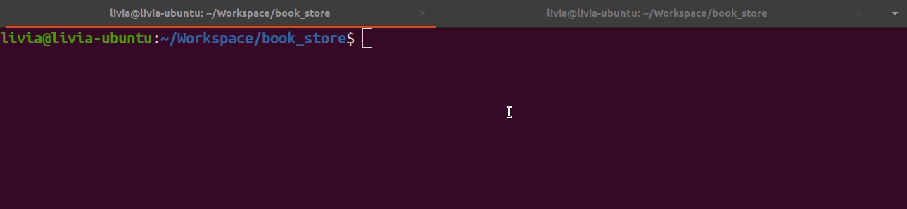
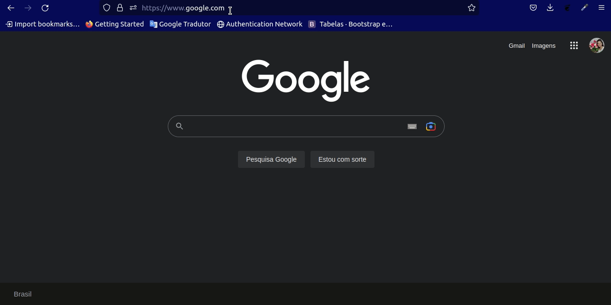
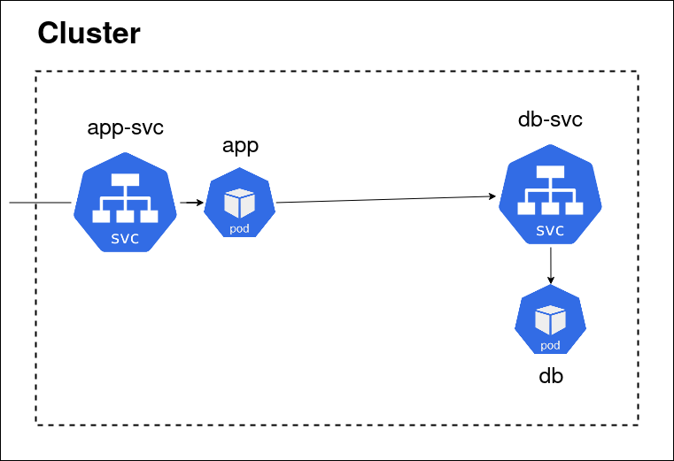
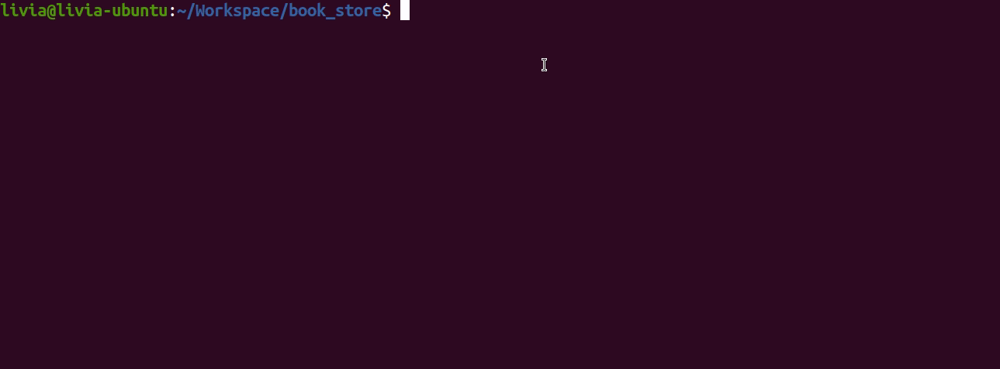
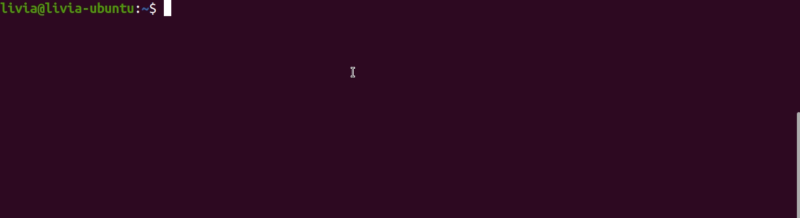

# Book Store

O escopo do projeto é uma loja de livros. Ele foi criado para treinar a integração entre uma aplicação web, conexão a banco de dados e entrega de serviços em VNF.




## Arquitetura


## Tecnologias utilizadas
### Aplicação web
* Flask
* MySQL Connector Lib
* HTML
* CSS

### Banco de dados
* MySQL

### Serviço
* Docker
* Kubernetes

## Pré-requisitos
* Instalar docker
* Instalar kubernetes
* Instalar minukube

## Instalação
``` console
git clone https://github.com/LiviaKarolayne/book_store.git
cd book_store/
./util/init.sh
```




## Access Book Store App
``` console
kubectl get nodes -o wide
curl <IP Address>:30500
```
⚠️ Projeto em construção

⚠️ As vulnerabilidades de segurança ainda não foram tratadas
