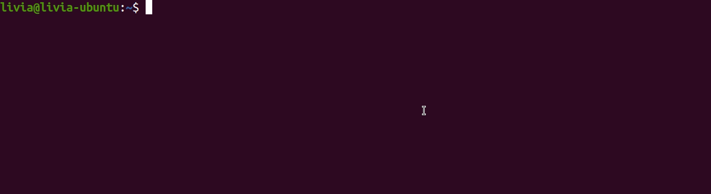

# Book Store


The scope of the project is a bookstore. It was created to train the integration between a web application, database connection and service delivery in VNF.


## Architecture


## Technologies used
### Web application
* Flask
* MySQL Connector Lib
* HTML
* CSS

### Database
* MySQL

### Infra
* Docker
* Kubernetes

## Prerequisites
* Install docker
* Install kubernetes
* Install minikube

## Installation
``` console
git clone https://github.com/LiviaKarolayne/book_store.git
cd book_store/
./util/init.sh
```




## Access Book Store App
``` console
kubectl get nodes -o wide
curl <IP Address>:30500
```

⚠️ Security vulnerabilities have not yet been addressed
